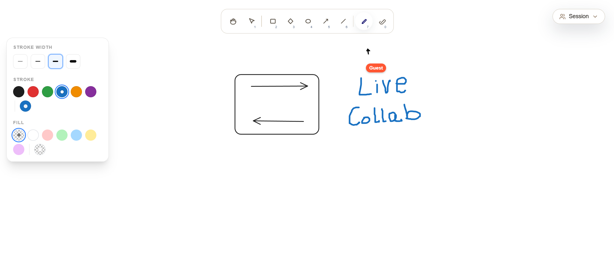

<div align="center">

# ✏️ Excalidraw Clone

A hand-drawn-style collaborative whiteboard, built from scratch on **Next.js**, **React**, and the HTML5 Canvas API — no drawing library, no shortcuts.

Live Demo: [https://excalidraw-clone.seven.vercel.app](https://excalidraw-clone.seven.vercel.app)




</div>

---

## 🧭 About

This is a personal, from-the-ground-up clone of [Excalidraw](https://excalidraw.com) — built to actually understand how a whiteboard app works under the hood: a raw `<canvas>` render loop, custom hit-testing and geometry math, a hand-drawn stroke renderer, and real-time multiplayer sync — rather than wrapping an existing canvas library.

---

## ✨ Features

- **Custom canvas rendering engine** — a single `renderElement()` pipeline that draws every shape type directly with the Canvas 2D API (no external rendering library)
- **Shape rendering** for:
    - Rectangle (rounded corners)
    - Diamond (rounded polygon math)
    - Ellipse
    - Line
    - Arrow (with computed arrowhead geometry)
    - Freehand draw (smoothed with quadratic curves between points for a natural, hand-drawn stroke feel)
- **Live preview while drawing** — the shape you're dragging is rendered in real time before it's committed to the canvas
- **Pointer-based interaction system** — unified mouse/pen/touch handling via the Pointer Events API
- **Bounding-rectangle normalization** — lets you drag in any direction (up/down/left/right) and still get a correct `x, y, width, height`
- **Toolbar UI** — a floating, rounded, grouped toolbar with icons for every planned tool, responsive/scrollable on small viewports
- **Global state with Zustand** — separate stores for canvas elements, the in-progress preview element, and the active tool
- **High-DPI canvas scaling** — crisp rendering on retina displays
- **Selection** — Select Shapes - Move and Resize
- **Hand (Pan)** — Infinite Canvas Panning
- **Zoom** — Infinite Zoom
- **Eraser** — Erase Elements
- **Real Time Collaboration** — Shared Sessions using web sockets allowin real time collaboration
- **Styled with Tailwind CSS v4**, on **Next.js 16 (App Router)**, **React 19**, and **TypeScript**


---

## 🛠️ Tech Stack

| Layer     | Choice                                                                       |
| --------- | ---------------------------------------------------------------------------- |
| Framework | [Next.js 16](https://nextjs.org) (App Router)                                |
| UI        | [React 19](https://react.dev) + [TypeScript](https://www.typescriptlang.org) |
| Rendering | Raw HTML5 `<canvas>`                    |
| State     | [Zustand](https://github.com/pmndrs/zustand)                                 |
| Styling   | [Tailwind CSS v4](https://tailwindcss.com)                                   |
| Linting   | ESLint 9                                                                     |

---

## 📁 Project Structure

```
web/
├── packages             # Shared Types and Schema
├── web                  # Frontend (Next JS)
├── sync-server          # Backend (Express JS)
```

---

## 🚀 Getting Started

```bash
# Clone the repo
git clone https://github.com/MuhammadTalha57/excalidraw-clone.git
cd excalidraw-clone/web

# Install dependencies
npm install

# Run the dev server
npm run dev
```

Open [http://localhost:3000](http://localhost:3000) to start drawing.

---

## 🤝 Contributing

This is currently a solo learning project, but issues, suggestions, and pull requests are welcome.

---

## 📄 License

No license has been added yet. Until one is added, please treat this repository as **all rights reserved**.
